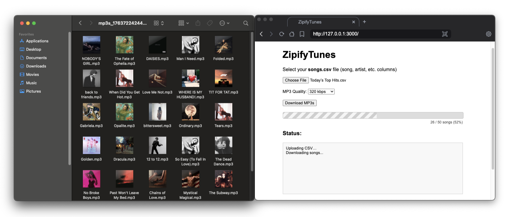
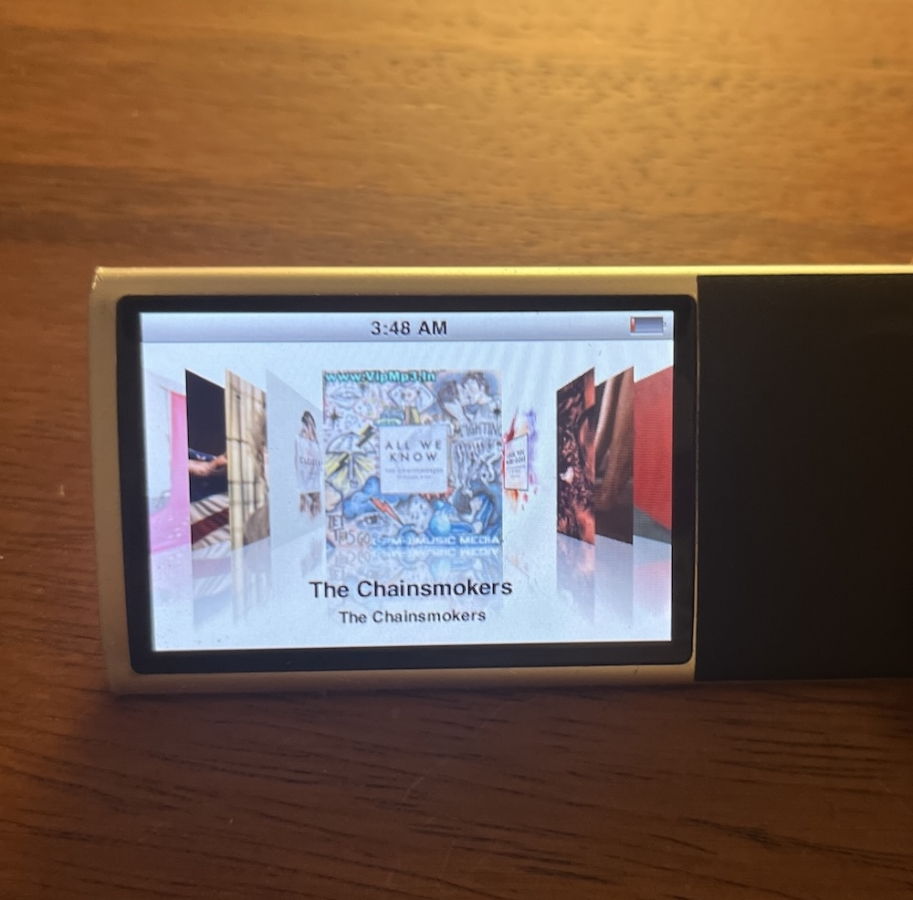

# ZipifyTunes

Convert any playlist CSV into a local ZIP of MP3 files with **album art** and **metadata** (title, artist, album, year, genre).
Everything runs **locally** on your machine.

Tired of streaming algorithms deciding what you should listen to?<br>
Tired of losing playlists, rising subscription prices, or limited offline access?<br>
ZipifyTunes lets you take back control; your music, your files, your way.

<div align="left">
    
</div>

## What it does

- Takes a **playlist CSV** (Spotify, Apple Music, YouTube Music, custom, etc.)
- For each row, it:
  - Reads **title**, **artist**, **album**, **year**, **genre** (from many possible column names)
  - Searches the track on **YouTube**
  - Downloads the audio as **MP3** using `youtube-dl-exec` / `yt-dlp`
  - Fetches square **album art** from the **iTunes Search API**
  - Writes **ID3 tags** (title, artist, album, year, genre) and embeds the cover
- Zips everything into `songs.zip` for you to download from the browser

## How it works

- **Upload:** The CSV you upload is stored briefly in `/uploads/` by `multer` and removed when the process finishes
- **Search:** `yt-search` finds the best matching YouTube video for each track
- **Download:** `youtube-dl-exec` (yt-dlp) downloads and converts audio to MP3 (saved temporarily inside an auto-generated folder like `mp3s_123456789/`)
- **Covers:** iTunes Search API provides square artwork, saved temporarily then embedded
- **Tagging:** `ffmpeg` writes ID3 tags: title, artist, album, year, genre + embedded cover
- **Packaging:** `archiver` builds a ZIP of all generated MP3s and streams it back to your browser

## Install & run

### node.js
Make sure you have Node.js installed:
👉 https://nodejs.org

### ffmpeg
FFmpeg handles audio processing, including embedding album art, writing MP3 metadata (ID3 tags), and packaging the final audio stream without re-encoding. It’s required because yt-dlp only downloads audio. FFmpeg does the tagging, cover embedding, and final MP3 formatting.

macOS (Homebrew):
```bash
brew install ffmpeg
```

Ubuntu / Debian Linux:
```bash
sudo apt update
sudo apt install ffmpeg
```

Windows:
```bash
winget install Gyan.FFmpeg
```
Manual install: https://www.gyan.dev/ffmpeg/builds/

### Run

```bash
# clone your repo
git clone https://github.com/yourname/zipify-tunes.git
cd zipify-tunes

# install dependencies
npm install

# start the local server
npm start

# then open 
http://localhost:3000
```

## How to use

1. Export your playlist as a CSV
   - You can use tools like https://www.chosic.com/spotify-playlist-exporter/
   - Or any other service that gives you a CSV with track info

2. Open `http://localhost:3000`

3. Choose your CSV file

4. Pick your MP3 quality (128 / 192 / 256 / 320 kbps or “Best”)

5. Click Download MP3s

6. Wait for the progress bar to reach 100%

7. Your browser will download `songs.zip` containing:
    - MP3s with:
        - Clean file names
        - Embedded album cover
        - Title / Artist / Album / Year / Genre tags

If you want to access your music from anywhere, you can use the [PeerSky Browser](https://github.com/p2plabsxyz/peersky-browser) and upload the generated ZIP from ZipifyTunes to [IPFS](https://docs.ipfs.tech/concepts/what-is-ipfs/) or [Hypercore](https://holepunch.to/). Then you can stream or download your MP3s through [public HTTP gateways](https://ipfs.github.io/public-gateway-checker/) directly on your phone.

## Disclaimer



This tool is intended only for personal, local use:<br>
- Do not use this project to infringe copyright, redistribute music, or share copyrighted material without permission.<br>
- You are solely responsible for how you use this code and for complying with your local laws and the terms of service of any platforms you access.
